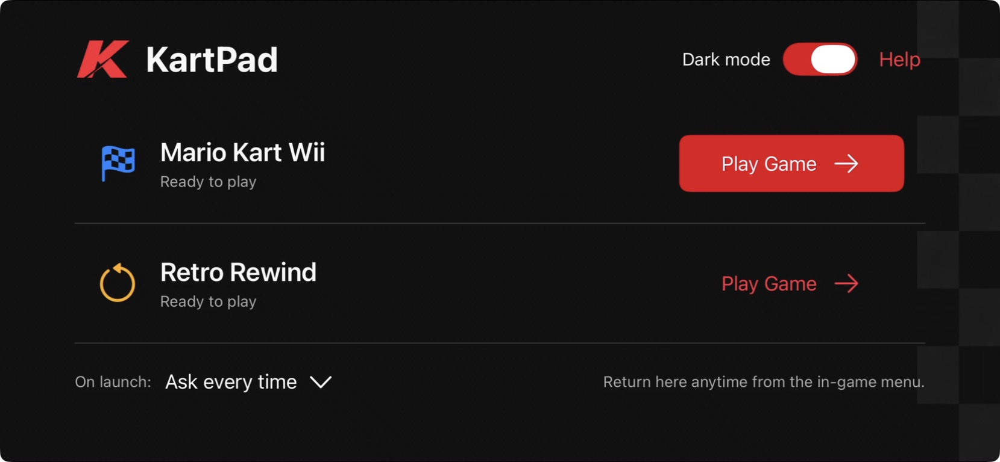
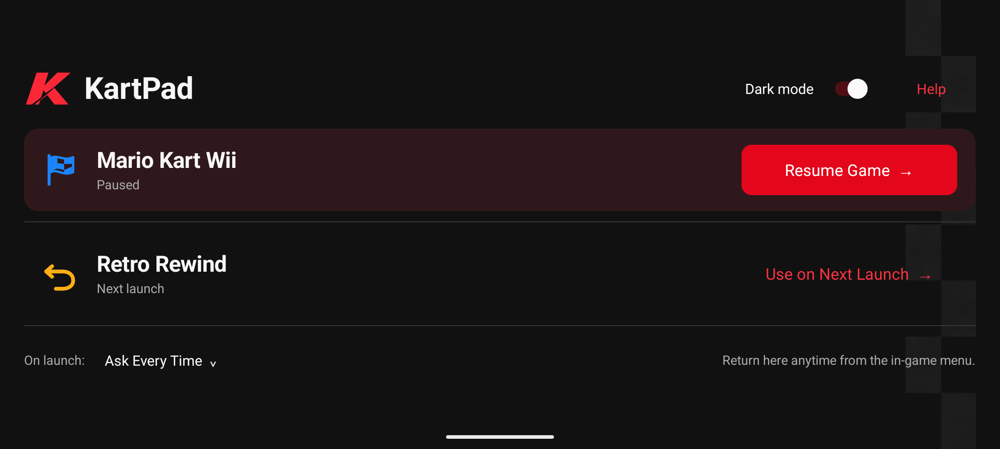
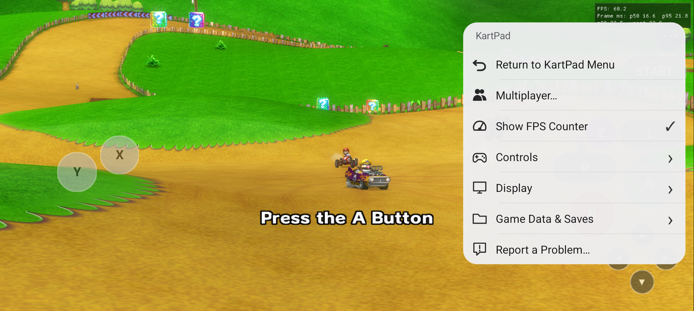
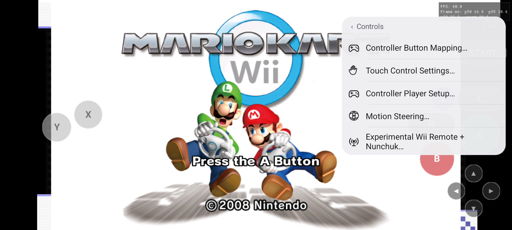
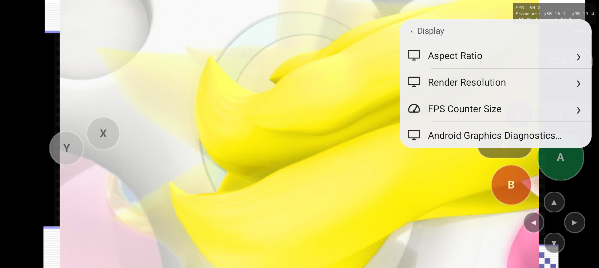
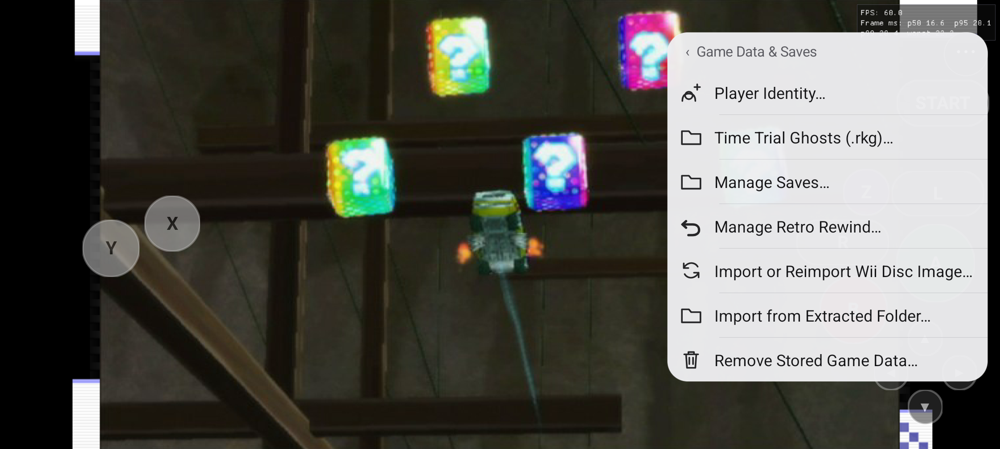
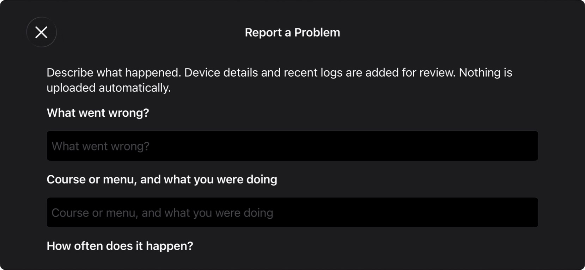

# KartPad 0.4.24 screenshots

Actual captures from the accepted iPhone build 49 and Android private candidate 116. Public Android 117 rebuilds the accepted source with release signing and profiling disabled. The Android background is the game's title demonstration; these screenshots are menu illustrations, not race performance measurements.

## iPhone launcher

## Android launcher

## In-game menu

## Controls

## Display

## Game Data & Saves

## iPhone problem report

